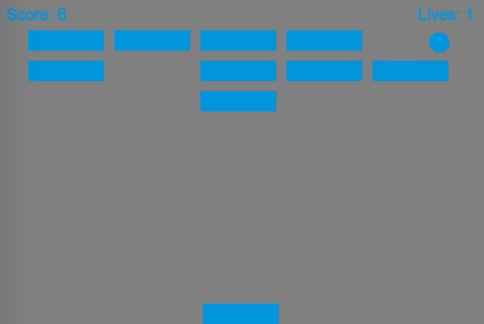
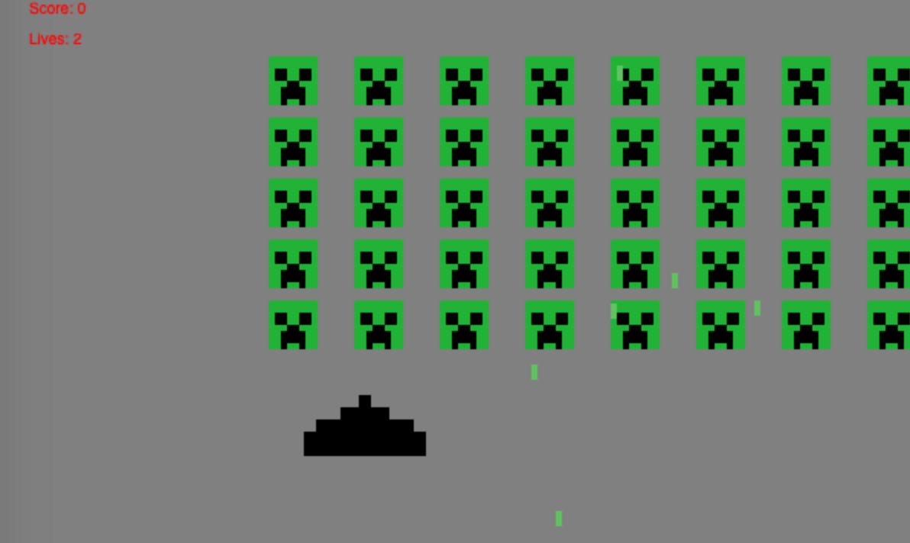
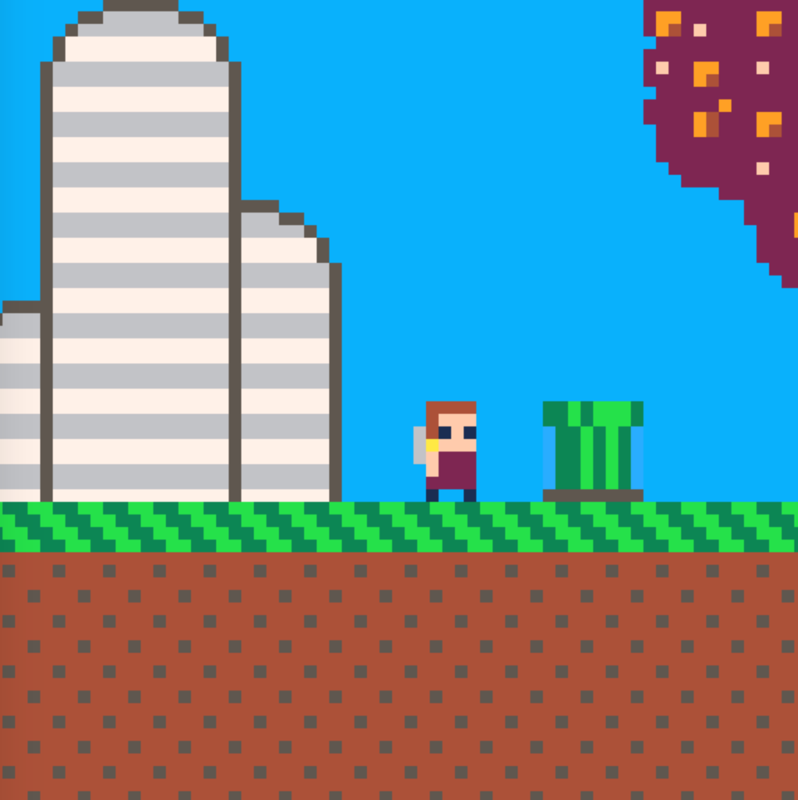

# ecsy-two

A 2d game/app Entity Component System for HTML Canvas. 
Built on top of ECSY.io.  A companion lib for ECSY-three.

# Goals

* Entity Component System for 2D games / apps
* super easy to start with
* scales as your code gets better
* hooks for audio, images, animated sprites, tilemaps
* input from keyboard, mouse, gamepad, WebXR devices

# Non-goals

* being a full game engine
* being the fastest web renderer
* building visual tools
* creating publishing mechanism or app store hooks. It's just a webpage.


# Getting Started

Install the library `ecsy-two` library via npm or any of the other usual ways.  Also install `ecsy` if it's
not already installed. Create an HTML page and import the `ecsy-two.js` module to start.

```html
<!DOCTYPE html>
<html lang="en">
<head>
    <meta charset="UTF-8">
    <title>My Rad Game</title>
</head>
<body>
<script type="module">
import {System, World, Component} from 'node_modules/ecsy/build/ecsy.module.js';
import ECSYTWO, {Canvas, InputState, KeyboardState, Sprite, FilledSprite} from 'node_modules/ecsy-two/src/ecsy-two.js';


</script>
</body>
</html>
```

The following code makes a blue rectangle that you can move around with the keyboard.
```javascript
let world = new World();  // make a new world


// register the systems we will need
// world.registerSystem(EcsyTwoSystem)
// world.registerSystem(SpriteSystem)
// world.registerSystem(KeyboardSystem)

// ECSYTWO.initialize() will register the commonly used systems for core, sprites, keyboard, mouse, and layers
// fullscreen and audio require separate registrations
ECSYTWO.initialize(world)

// make the game area
let game = world.createEntity()
    .addComponent(Canvas, { width: 100, height: 100, scale: 3} )
    .addComponent(InputState)
    .addComponent(KeyboardState)

// make the player sprite be a blue square
let player = world.createEntity()
    .addComponent(Sprite, { x: 50, y: 50, width: 10, height: 10} )
    .addComponent(FilledSprite, { color: 'blue'})


// a system to move the player around using input events
class MyGame extends System {
    execute(delta, time) {
        this.queries.input.results.forEach(ent => {
            let input = ent.getComponent(InputState)        
            this.queries.player.results.forEach(ent => {
                let player = ent.getComponent(Sprite);
                if(input.states.left)  player.x +=  -10       
                if(input.states.right) player.x +=  +10       
                if(input.states.up)    player.y +=  -10       
                if(input.states.down)  player.y +=  +10       
            })
        })    
    }
};
//define the queries the system will use
MyGame.queries = { 
    player: { components: [Sprite]},
    input: { components: [InputState]}, 
};
world.registerSystem(MyGame) // register the system to use it

ECSYTWO.start(world) // start the main event loop
```
The above code first creates a new `world`. This is the global system. Everything in your app
will be tied to this world. If you want multiple apps in a single page you can have multiple worlds.

The first entity represents the playing area. Canvas will create an HTML canvas of the given logical width and
height. `scale` will scale up the canvas, so you can do retro pixel games. Set pixelMode:true to turn of the browser's
image smoothing.

The InputState is a set of booleans for different input values. By default it will have states for 
up, down, left, and right. The KeyboardState contains the state of actual keyboard keys.  KeyboardSystem will use
it's bindings to map keys to input states. The default binding uses arrow keys, but you can customize it. For
example, if you wanted to support WASD as well as arrow keys:

```javascript
some_entity.addComponent(KeyboardState, {
    mapping: {
        'w':'up',
        'a':'left',
        's':'down',
        'd':'right',
        'ArrowLeft':'left',
        'ArrowRight':'right',
        'ArrowUp':'up',
        'ArrowDown':'down',
    }
})
```

In ECSY Two the position and size of objects onscreen are separate from the actual visual presentation. 
The `Sprite` component is simply a drawable entity with x/y/weight/height bounds. It does not actually draw anything. 
To draw you need to attach a component like FilledSprite with a color. 
Other options include ImageSprite, AnimatedSprite, and CustomSprite.

To create behavior you need to create your own Systems. The system above moves the sprite around using 
the input state. The `execute` function of the `MyGame` system is called on every frame 
(typically 60 times per second).


# more

The full docs are available here.  

Components and Systems you may find interesting.

## Core API
#### Canvas

Creates an HTML canvas in the page. Default width and height are 100. Default scale is 1. Set pixelMode:true
to disable image smoothing. Set the target canvas with 'target'. If no target is set, then it will create
a new canvas and append it to the document. 

#### BackgroundFill

Fills the canvas with a color.  ex:
  
``` javascript
addComponent(BackgroundFill, { color:'yellow'})
```

#### Camera

`Camera` translates the canvas drawing. Can be used with
`CameraFollowsSprite` to make the canvas always draw
with the player sprite in the center.

#### Sprite

An object on screen with width height x and y. You must add
another sprite component like FilledSprite to actually see it drawn
on screen.

#### FilledSprite

Fills a sprite with a color.

#### DebugOutline

Draws a red border around a sprite. Helpfully when debugging the
location of your sprites.

### ImageSprite

Draws a sprite with an image. Can load the image from a url. ex:

```javascript
let player = world.createEntity()
    .addComponent(Sprite, { width: 16, height: 16})
    .addComponent(ImageSprite, { src: "images/player.png"})
```

### AnimatedSprite

Draws a sprite from a set of animation frames.


## Layers

You can control the drawing order of objects on screen by using layers. By default all objects will draw into
a default layer, but you can add new layers and choose the layer yourself. ex:

Create two layers, one containing an image and the other a filled rectangle.

```javascript
let backg = world.createEntity().addComponent(Layer, { name: "background", depth:50})
let front = world.createEntity().addComponent(Layer, { name: "front", depth:100})

world.createEntity()
    // set size, position, and put on the front layer
    .addComponent(Sprite, { x: 10, y: 10, width: 50, height:50, layer:"background"})
    .addComponent(ImageSprite, { src:"image.png"})

world.createEntity()
    .addComponent(Sprite, { x: 15, y: 15, width: 100, height:50, layer:"front"})
    .addComponent(FilledSprite, { color: 'red'})
```


All standard drawing components like FilledSprite, ImageSprite, etc. know how to draw into layers. If you want to
do custom drawing you can add a LayerParent component to your entity which specifies the layer to draw into and a layer drawing command object,
which is just an object with a `draw` method on it.

ex: a custom circle component

```javascript
class Circle {
    constructor() {
        this.x = 0
        this.y = 0
        this.radius = 10
        this.color = 'red' 
    }
}
const CircleDrawer = {
    draw:(ctx, canvas_ent, target_ent) => {
        let c = target_ent.getComponent(Circle)
        ctx.beginPath()
        ctx.fillStyle = c.color
        ctx.arc(c.x,c.y,c.radius,0,Math.PI*2)
        ctx.fill()
    }
}

world.createEntity()
    .addComponent(Circle, { x: 50, y: 50, radius: 20, color: 'blue'})
    .addComponent(LayerParent, { layer:'background', draw_object:CircleDrawer })
```


## Inputs

#### InputState

Abstract representation of the input states.  Just a set of booleans.  For example: input.states.left === true
means the user wants to go left.

#### KeyboardState

`KeyboardState` is the current state of the keyboard keys. Set a binding to convert specific keys into abstract
input states on the `InputState`. Uses `KeyboardSystem`  ex:

```javascript
player
    .addComponent(InputState)
    .addComponent(KeyboardState, {
        mapping: {
            'w':'up',
            'a':'left',
            's':'down',
            'd':'right',
            ' ':'jump',
            'ArrowLeft':'left',
            'ArrowRight':'right',
            'ArrowUp':'up',
            'ArrowDown':'down',
        }
    })

// now read from inputState.states.left, inputState.states.right, etc.
```

#### MouseState

Current cursor position and button state. `clientX` and `clientY` represent the current x and y of the mouse
cursor.

#### Gamepad

Register `GamepadSystem` to use gamepads. It is not registered by default. 

Then add a `SimpleGamepadState` component to wherever you have 
your `InputState` component. The `SimpleGamepadState` component will set the
`left`, `right`, `up`, and `down` states of the InputState component it is added 
to. You can configure the threshold for analog sticks using 
the `axis_threshold` property, which is 0.4 by default.

See the [simple example](examples/simple) for an example
of using both the keyboard and gamepad together.

Currently recognizing the more advance states of complex controllers is not supported.
You would have to copy and fork the the gamepad.js to get additional data. Or please
[file an issue](https://github.com/joshmarinacci/ecsy-two/issues) with 
the data you want to access.

*Note that the Gamepad API is very flaky, and for security reasons a gamepad
controller may not be visible to your game unless the user presses a specific
button on the controller or disconnects and connects it to their computer.*


### Audio

The AudioSystem plays sounds using the Audio() DOM element. Used for recorded sounds from WAV and MP3s.  Due to
browser security concerns, no actual audio will be heard until the first click or touch from the user on the document.


#### SoundEffect

Play a sound effect.  Will not actually be played until you add the PlaySoundEffect component. Default volume is 1.0.

```javascript
// create bullet object
let bullet = world.createEntity()
    .addComponent(SoundEffect, { src: "audio/fire.wav"})

// play sound by adding PlaySoundEffect component
bullet.addComponent(PlaySoundEffect)
```

#### Background Music

Play a  sound waveform (`.wav`, `.mp3`, etc) on a loop. Will automatically play once added. Remove it to stop it. Default volume is 0.5.

```javascript
world.createEntity()
    .addComponent(BackgroundMusic, { src:'song.mp3', volume: 0.7})
```


### Music

Music plays sounds using synth notes using the `tone.js` library.

 
#### BackgroundNotes
Play a sequence of notes, looping forever.

```javascript
    view.addComponent(BackgroundNotes, {notes:[
            "C3","D3","E3",
            "C3","D3","E3",
            "C3","D3","E3",
            "C3","D3","E3",

            "D3","E3","F3",
            "D3","E3","F3",
            "D3","E3","F3",
            "D3","E3","F3",
        ]})
```

#### Notes

Play a short sequence of notes once.


### Non-core Extensions


### GamepadInput

### Fullscreen Support

### Touchscreen Support

### WebXR Support

### Tilemap 

### Dialog

### platformer physics & controls

### Overhead RPG like controls

# Examples


### 
Simple: move a player sprite around the screen using the keyboard.  Render two enemy sprites.
Use layers to make the player sprite be drawn above the other two. 

[source](examples/simple/)


### Breakout

A simple Breakout game, adapted from [the MDN tutorial](https://developer.mozilla.org/en-US/docs/Games/Tutorials/2D_Breakout_game_pure_JavaScript/Create_the_Canvas_and_draw_on_it) 
by End3r.

[source](examples/breakout/)

    

### Invaders

A space invaders clone, adapted from 
the [Space Invaders tutorial](https://www.briankoponen.com/html5-javascript-game-tutorial/) by
[Brian Koponen](https://www.briankoponen.com/)

[source](examples/invaders/)



 
### Platformer

A simple platformer game using tilemaps and mario style physics. Created by joshmarinacci.

[source](examples/platformer/)



